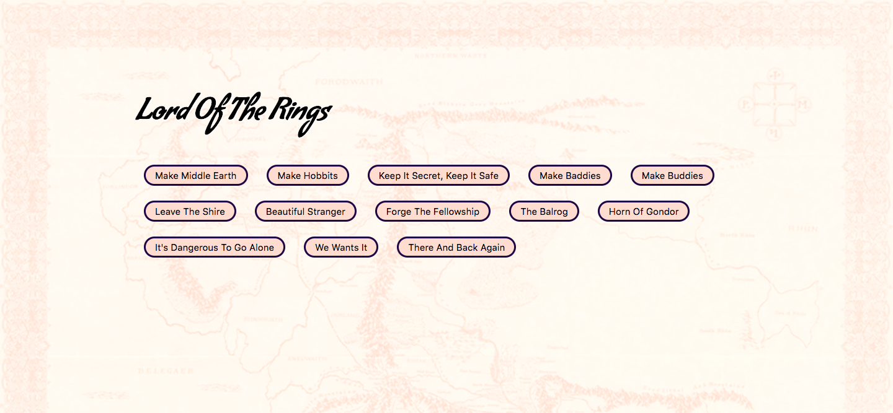

# Lord of the Rings
> A site that allows you to take a trip through Mordor!

	https://yamilburgos.github.io/LordOfTheRingsSite

## Meta
[Yamil Burgos](https://github.com/yamilburgos/) – yamil.burgos1293@gmail.com

## Contributing
1. Fork it (<https://github.com/yamilburgos/LordOfTheRingsSite/fork>)
2. Create your feature branch (`git checkout -b feature/fooBar`)
3. Commit your changes (`git commit -am 'Add some fooBar'`)
4. Push to the branch (`git push origin feature/fooBar`)
5. Create a new Pull Request
